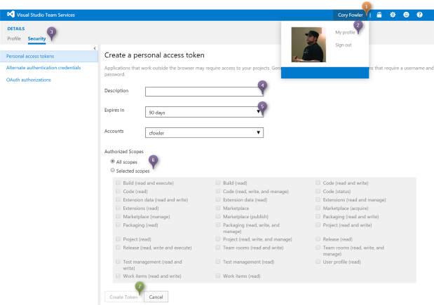

# Visual Studio Team Services PHP Agent VM

## About

This script helps bootstrap a Visual Studio Team Services Build Agent for PHP.

## Prerequisites

There are two required steps before the deployment of this VM can be successful:

1. [Configure Permissions for VSTS Agent Pools](configure-permissions)
1. [Create Personal Access Token (PAT)](create-a-personal-access-token)

### Configure Permissions

### Create a Personal Access Token

Once you've logged into your Visual Studio Team Services account, follow these steps:

1. Click on the **Username** in the top level menu
1. From the dropdown, click on **My Profile**
1. Click on the **Security** tab
1. Enter a **Description** for the Personal Access Token
1. Select an **Expiry In** duration
1. Select the relevant **Authorized Scopes**  
  * Select **All scopes**; or
  * Select **Select scopes**, then proceed to select the desired scopes for the Access Token  
    * Build (read and execute)
    * Code (read)
1. Click **Create Token**

